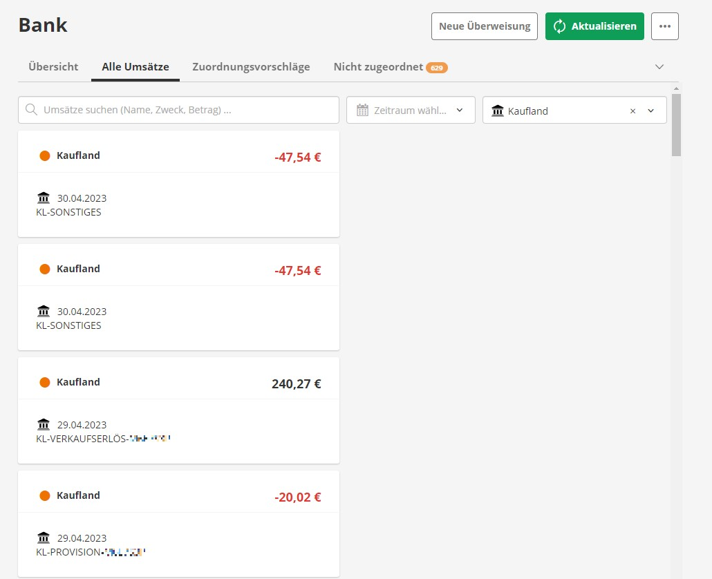

# Export der Kaufland Buchungen und Import in Lexoffice
Das Helfer Tool wandelt den Buchungs Export von Kaufland in ein CSV-Format um, welches nahtlos in ein Lexoffice Bank Konto importiert werden kann. Im Anschluss können die Zahlungseingänge den Kunden Rechnungen zugewiesen werden. 

## Anleitung
- In Lexoffice ein neues Bankkonto anlegen.
-- Am Besten nach der Bank "Kaufland" suchen und auf die Meldung "Ihre Bank unterstützt leider keine Anbindung." warten.
- Auszahlung in Kaufland durchführen und die CSV-Datei aus der Mail "Ihr Buchungsreport" öffnen.
- Den kompletten Inhalt der CSV-Datei in die input.csv kopieren.
- Go Script ausführen
```go
go run main.go
```
- [Bankübersicht](https://app.lexoffice.de/fis/olb4/#/hub) in Lexoffice öffnen und bei dem Kaufland Konto die drei Punkte Auswählen und den CSV Import starten.

**⚠️ Hinweise ⚠️**
- Weder das Helfer Tool noch Lexoffice verfügen über eine Prüfung von doppelten Einträgen. Daher empfehle ich, den Buchungsreport aus der "Auszahlungs" E-Mail zu verwenden und nicht von der Reportsseite. Im schlimmsten Fall könnten Buchungen doppelt in Lexoffice auftauchen.
- Es werden nur Verkaufserlöse berücksichtigt, um Rechnungen als bezahlt zu markieren. Provisionen oder Anzeigengebühren werden nicht erfasst, da diese in einigen Fällen nicht korrekt gegen die monatliche Kaufland-Rechnung verbucht werden können.
- Aktuell werden Buchungsreports für Deutschland und die Slowakei unterstützt.

## Verbesserungsideen
- Automatische Erstellung und Verarbeitung des Kaufland-Reports
- Validierung und Verhinderung von doppelten Einträgen.
- Automatische Buchun

## Beispiel in Lexoffice
